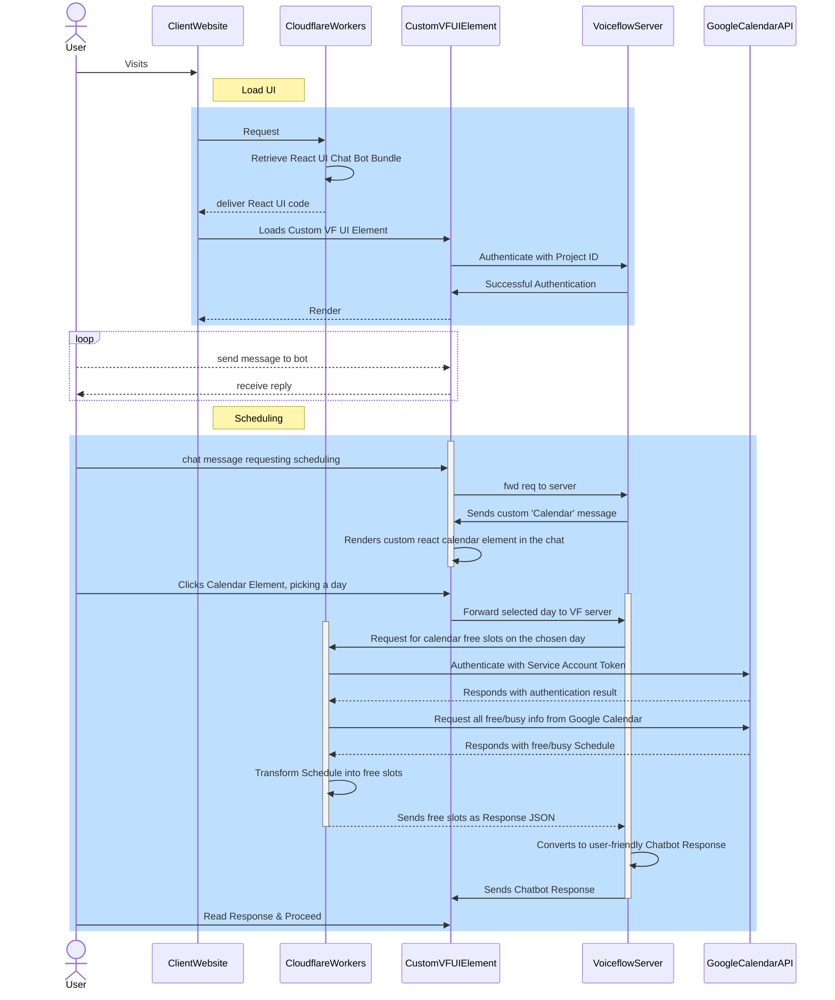

# voiceflow_custom_interactions
Demo the ability to integrate custom interactions into a voiceflow chatbot

https://marcusdatathemis.github.io/voiceflow_custom_interactions/

calendar: https://calendar.google.com/calendar/u/2/r/week

Diagram created and editable via: https://mermaid.live/edit
